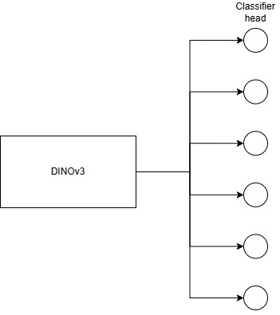
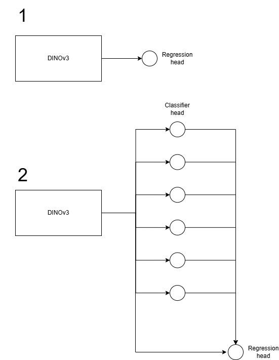

# ThaiPost Cargo Space Classifier (DINOv3)

A classifier that predicts how full a Thai Post truck's cargo space is, from a single camera image, using a DINOv3 ViT-S/16+ backbone with an optional Dual Attention head.

The model produces one of six empty-level classes:

| Index | Class folder | Empty level | Plot label |
|-------|--------------|------------|------------|
| 0 | `0 _` | 0% | `0 (6)` |
| 1 | `1-20 _` | 1–20% | `1-20 (5)` |
| 2 | `21-40 _` | 21–40% | `21-40 (4)` |
| 3 | `41-60 _` | 41–60% | `41-60 (3)` |
| 4 | `61-80 _` | 61–80% | `61-80 (2)` |
| 5 | `81-100 _` | 81–100% | `81-100 (1)` |

---

## Project structure

```
thaipost-dino/
├── attention/                  Attention modules
│   ├── position.py             PositionAttentionModule (spatial self-attention)
│   ├── channel.py              ChannelAttentionModule (channel-wise attention)
│   └── dual.py                 DualAttentionModule (PAM + CAM, concatenated)
├── loss/
│   └── cdb.py                  CDB_loss — fix imbalance problem
├── models/
│   └── network.py              Network — DINOv3 backbone + optional DAM + classifier head
├── datasets/
│   └── cargo.py                CargoSpaceDataset (labeled) + CLASS_NAMES / PLOT_CLASS_NAMES
├── transforms/
│   └── night_vision.py         SimulateNightVision — grayscale + contrast + noise
├── checkpoints/                Trained .pth weights (created by training script)
├── dinov3_training.py          Train the classifier
└── dinov3_evaluation.py        Evaluate on the labeled test split (+ optional visualization)
```

---

## Dataset layout

Place your labeled data under a single root directory (default: `Cargo space/`). Each of the six class folders contains two camera subfolders:

```
Cargo space/
├── 0 _/
│   ├── กล้องหน้า/
│   │   ├── img001.jpg
│   │   └── img002.jpg
│   └── กล้องหลัง/
│       └── ...
├── 1-20 _/
│   ├── กล้องหน้า/
│   └── กล้องหลัง/
├── 21-40 _/
├── 41-60 _/
├── 61-80 _/
└── 81-100 _/
```

- Class folder names must include the trailing ` _` (underscore preceded by a space).
- Supported image extensions: `.jpg`, `.jpeg`, `.png` (case-insensitive).
- Camera subfolder names are the Thai words exactly as shown above.

### Split modes (`-d`)

| `-d` | Description |
|------|-------------|
| `0`  | 80% / 20% train/test split on **front-camera images only** |
| `1`  | 80% / 20% train/test split on **front + back camera images** |

The split is deterministic — files are sorted alphabetically, then shuffled with `seed=42` before slicing.

---

## Installation

This project is configured for **uv** with GPU-enabled PyTorch (CUDA 12.4 wheels) pinned in [pyproject.toml](pyproject.toml). The CDB loss in [loss/cdb.py](loss/cdb.py) calls `.cuda()` unconditionally, so a CUDA-capable GPU is required for `-l cdb`. Training and evaluation auto-fall-back to CPU otherwise.

### Quick start (uv, recommended)

From the project root:

```powershell
uv sync
```

This creates a local `.venv` and installs:
- `torch` and `torchvision` from `https://download.pytorch.org/whl/cu124`
- everything else (`transformers`, `numpy`, `psutil`, `matplotlib`, `seaborn`, `scikit-learn`, `Pillow`) from PyPI

### Verify the GPU is visible

```powershell
uv run python -c "import torch; print('CUDA available:', torch.cuda.is_available()); print('CUDA version:', torch.version.cuda); print('Device:', torch.cuda.get_device_name(0) if torch.cuda.is_available() else 'CPU only')"
```

Expected output:
```
CUDA available: True
CUDA version: 12.4
Device: NVIDIA GeForce RTX 3050 ...
```

### Matching your CUDA version

The `pyproject.toml` defaults to **CUDA 12.4 wheels** (`cu124`). PyTorch wheels are forward-compatible — a `cu124` build runs on any driver ≥ 12.4 (including 12.5, 12.6, etc.), so most users don't need to change anything.

Check your driver's CUDA version:

```powershell
nvidia-smi
```

Look at the top-right `CUDA Version: X.Y` field. Choose a PyTorch wheel index where `X.Y` is **less than or equal to** that value.

| Your driver | Recommended wheel | Index URL suffix |
|---|---|---|
| CUDA 11.8 | `cu118` | `/cu118` |
| CUDA 12.1 – 12.3 | `cu121` | `/cu121` |
| CUDA 12.4 – 12.5 | `cu124` (default) | `/cu124` |
| CUDA 12.6+ | `cu126` | `/cu126` |
| CUDA 12.8+ | `cu128` | `/cu128` |
| No GPU / CPU only | `cpu` | `/cpu` |

To switch versions, edit the `[tool.uv.sources]` and `[[tool.uv.index]]` blocks in `pyproject.toml`. For example, to use CUDA 12.6:

```toml
[tool.uv.sources]
torch = [{ index = "pytorch-cu126" }]
torchvision = [{ index = "pytorch-cu126" }]

[[tool.uv.index]]
name = "pytorch-cu126"
url = "https://download.pytorch.org/whl/cu126"
explicit = true
```

For CPU-only:

```toml
[tool.uv.sources]
torch = [{ index = "pytorch-cpu" }]
torchvision = [{ index = "pytorch-cpu" }]

[[tool.uv.index]]
name = "pytorch-cpu"
url = "https://download.pytorch.org/whl/cpu"
explicit = true
```

After editing, re-sync:

```powershell
uv sync --reinstall-package torch --reinstall-package torchvision
```

Available wheel indexes are listed at [pytorch.org/get-started/locally](https://pytorch.org/get-started/locally/).

### Plain pip (alternative)

If you're not using uv, install manually. Replace `cu124` in the index URL with the version that matches your driver (see table above):

```powershell
pip install torch torchvision --index-url https://download.pytorch.org/whl/cu124
pip install transformers Pillow numpy psutil matplotlib seaborn scikit-learn
```

---

## How to run


### 1. Training

```powershell
uv run .\dinov3_training.py -d 1 -a dam -l cdb --data_dir "Cargo space" --epochs 50 --batch_size 16
```

| Flag | Required | Default | Description |
|------|----------|---------|-------------|
| `-d`, `--dataset` | yes | — | Split mode: `0` or `1` (see above) |
| `-a`, `--attention` | yes | — | `none` or `dam` |
| `-l`, `--loss` | yes | — | `ce` (cross-entropy) or `cdb` (class-difficulty balanced) |
| `--data_dir` | no | `Cargo space` | Root directory of the labeled dataset |
| `--batch_size` | no | `16` | |
| `--epochs` | no | `50` | |
| `--tau` | no | `dynamic` | Tau for CDB loss (`dynamic` or a float) |
| `--save_dir` | no | `./checkpoints` | Where to write checkpoints |

The training script:
1. Builds two copies of the train split — one with the eval transform, one with augmentation (horizontal flip, rotation, affine, color jitter) — and concatenates them.
2. Runs validation every epoch; if accuracy improves, saves to `checkpoints/best_model_data{D}_{ATTN}_{LOSS}_v2_aug.pth`.
3. With `-l cdb`, recomputes per-class loss weights every epoch from the current validation accuracies.

> **Note:** `CDB_loss` calls `.cuda()` unconditionally, so `-l cdb` requires a GPU. Use `-l ce` on CPU-only machines.

### 2. Evaluation

```powershell
uv run .\dinov3_evaluation.py -w best_model_data1_dam_cdb_v2_aug.pth -d 1 -a dam
```

| Flag | Required | Default | Description |
|------|----------|---------|-------------|
| `-w`, `--weights` | yes | — | Checkpoint **filename** (the script prepends `checkpoints/`) |
| `-d`, `--dataset` | yes | — | Must match the training split |
| `-a`, `--attention` | yes | — | Must match the trained architecture |
| `--data_dir` | no | `Cargo space` | |
| `--batch_size` | no | `16` | |
| `--save_vis` | no | off | Save per-image visualization PNGs |
| `--vis_dir` | no | `predict` | Where to write visualization PNGs |
| `--vis_max_correct` | no | `20` | Max correct samples saved per class (set `0` to save only wrong predictions) |

Outputs:
- Console report: accuracy, macro precision/recall/F1, per-class breakdown, RAM/VRAM, latency, throughput.
- `confusion_matrix_<weights>.png` in the project root.
- When `--save_vis` is enabled, per-image PNGs grouped by **true class** under `--vis_dir`:
  ```
  predict/
  ├── correct/
  │   ├── class 6/    (true label = "0 _")
  │   ├── class 5/    (true label = "1-20 _")
  │   └── ...
  └── false/
      ├── class 6/
      └── ...
  ```
  Each image is annotated with predicted class, confidence, and ground truth — green title if correct, red if wrong.

---

## Architecture

### Current Best

DINOv3 backbone → linear classifier → CDB loss.



### Next experiment — regression head




**1. Pure regression head**

Delete the linear classifier head and replace it with a regression head that outputs one scalar fill-percentage.

```
backbone (B, C, H, W)
   ↓  (DAM) → GAP → flatten
feat (B, in_chan)
   ↓  reg_head: Linear → ReLU → Linear(reg_hidden, 1)
value (B,) 
```

**2. Classifier head → regression**

Keep the existing linear classifier head and feed its output into a regression head. The classifier provides a class-prior signal that the regression head refines into a continuous value. Two variants depending on whether backbone features are also passed through:

**2a. With backbone feature (concat)**

Concatenate the pooled backbone feature with the classifier's 6 logits and feed the joint vector into the regression head. Richer input — regression sees both the raw representation and the class signal.

```
backbone (B, C, H, W)
   ↓  (DAM) → GAP → flatten
pooled (B, in_chan)
   ↓  fc → LayerNorm
logits (B, 6)
   ↓  concat([pooled, logits])
joint (B, in_chan + 6)
   ↓  reg_head: Linear → ReLU → Linear(reg_hidden, 1)
value (B,)
```

**2b. Logits only (no backbone feature)**

Skip the concat — feed only the 6 classifier logits into the regression head. Much smaller regression head (`6 → reg_hidden → 1`), and the regression is forced to use the classifier's decision as its sole evidence.

```
backbone (B, C, H, W)
   ↓  (DAM) → GAP → flatten
pooled (B, in_chan)
   ↓  fc → LayerNorm
logits (B, 6)
   ↓  reg_head: Linear(6, reg_hidden) → ReLU → Linear(reg_hidden, 1)
value (B,)
```

Both variants: forward returns `(logits, value)`. Joint loss:

```python
loss = ce_or_cdb(logits, labels) + alpha * l1_loss(value, percentage_targets)
```


